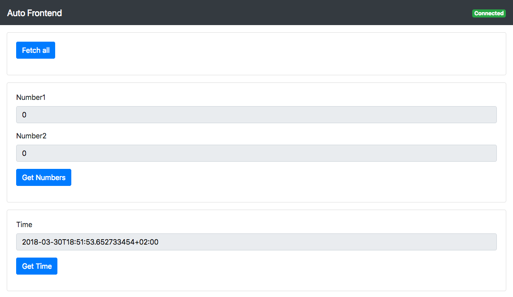

go-auto-frontend
===
> Automatically generate frontends for go programs  



## Why?

Sometimes you want to write go programms without an exhaustive REST api. Auto Frontend lets you dynamically generate a simple, web based frontend for your application.  

## How?

There are currently three basic types of interactions available:

1. get values from your programm
2. set values in your programm
3. execute a function whithout getting or setting a specific value

### Process

1. Set up your buttons and callback functions
2. Crete a new auto frontend instance
3. Register your buttons
4. Start the auto frontend instance


## Features

* Runs a temporary frontend for a go program
* Use your own HTML template
* Basic template provided, includes Bootstrap CSS
* Connectivity status detection via WebSockets

## Getting started

```shell
go get github.com/iwittkau/auto-frontend
```

### Basic Example

```go
package main

import (
	"fmt"

	"github.com/iwittkau/auto-frontend/button"
	"github.com/iwittkau/auto-frontend/frontend"
)

var (
	number  = 0
	getFunc = func() map[string]interface{} {
		return map[string]interface{}{
			"Number": number,
		}
	}

	setFunc = func(data map[string]interface{}) {
		fmt.Sscanf(data["Number"].(string), "%d", &number)
	}
)

func main() {

	// a button for getting the 'number' var
	// params: name, button styling class, button keys and a callback function
	// The button styling classes are aligned with Bootstrap: https://getbootstrap.com/docs/4.0/components/buttons/#examples
	btnGet1 := button.NewGet("Get Number", button.DefaultClassGet, button.Keys{"Number"}, getFunc)

	// a button to set the var
	btnSet1 := button.NewSet("Set Number", button.DefaultClassSet, button.Keys{"Number"}, setFunc)

	// Set a name, address with port, and a HTML template path (leave empty to use the default template)
	f := frontend.New("Auto Frontend", "localhost:8080", "")

	// register get button
	f.RegisterGetButtons(btnGet1)

	// register set button
	f.RegisterSetButtons(btnSet1)

	// start the frontend
	if err := f.Start(); err != nil {
		panic(err)
	}

	// frontend.Start() blocks, because it uses http.ListenAndServe()

}

```

Also check the example in `example/multiple-components/`.

## Button Callback Functions

There are three types of callback functions, one for each component type:

```go
type GetCallback func() map[string]interface{}
type SetCallback func(map[string]interface{})
type DoCallback func()
```

You have to implement these functions yourself. Panics inside these functions are recovered by the `http` package.

## Button Keys

The keys of Get and Set buttons are required to generate the input fields in the frontend. 

**Please do not use keys with spaces!**

This may work on the go side, but in the frontend they are used as IDs for HTML elements. Spaces in keys will break HTML frontend functions.

### How to use keys 
Consider this button:

```go
btnGet1 := button.NewGet("Get Number", button.DefaultClassGet, button.Keys{"Number"}, getFunc)
```

In the button callback you have to use the same key:

```go
getFunc = func() map[string]interface{} {
	return map[string]interface{}{
		"Number": number,
	}
}

```

*Notice: there is a `button.Keys{}` struct available to declare keys.*

### Common mistakes with wrong keys

You might encounter a panic like this:

```
2018/04/03 14:58:21 http: panic serving 127.0.0.1:56107: interface conversion: interface {} is nil, not string
```

This is most certanly caused by a callback like this:

```go
func(data map[string]interface{}) {
	fmt.Sscanf(data["Number3"].(string), "%d", &number2)
})
```

There might be no data available for the Key `Number3`, because this callback was set up for `Number2`.


## Contributing

As I use this for my own projects, I know this might not be the perfect approach
for all the projects out there. If you have any ideas, just
[open an issue][issues] and tell me what you think.


## Related projects

I don't know of any other projects like this, that's why I created Auto Frontend in the first place.
If you know of any other projects like this, please let me know.

## Licensing

This project is licensed under MIT License.

## Shoutouts

This project uses [xid](https://github.com/rs/xid), a Globally Unique ID Generator made by [rs](https://github.com/rs/).
Thanks to [jehna](https://github.com/jehna) for the README [template](https://github.com/jehna/readme-best-practices).

[issues]:https://github.com/iwittkau/auto-frontend/issues/new